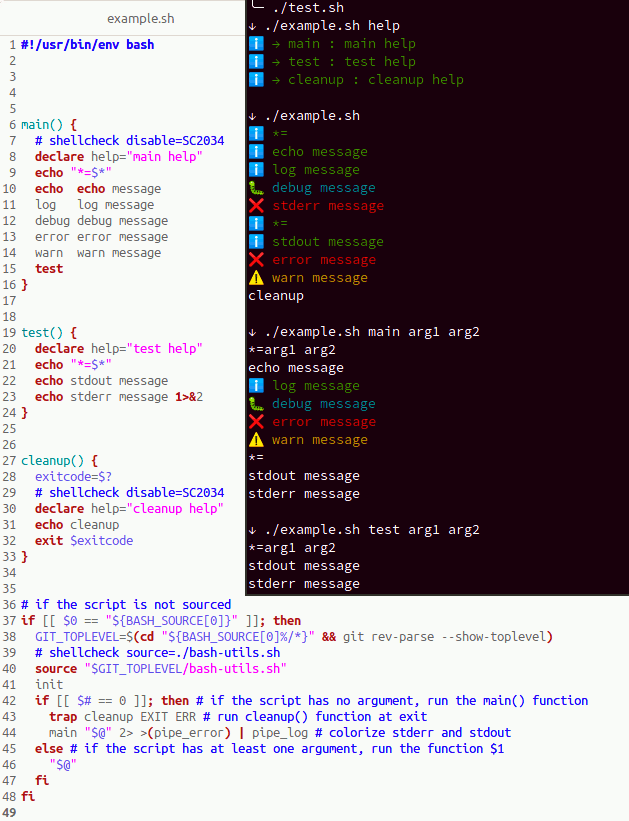

# Bash-utils

Ce projet rassemble quelques fonctions et méthodes que j'utilise régulièrement.

Pour l'utiliser, il faut sourcer le fichier bash-utils.sh :

```
source ./bash-utils.sh
utils:log log message test
```





## Bonnes pratiques d'écriture de scripts bash
Ci-dessous, quelques bonnes pratiques acquises avec l'expériance mais surtout pas
mal de lectures du web (bonne pratiques de mon point de vue...).

Quelques liens sur ce sujet:
* https://kvz.io/bash-best-practices.html
* https://bertvv.github.io/cheat-sheets/Bash.html
* https://github.com/progrium/bashstyle
* http://google.github.io/styleguide/shellguide.html
* https://google.github.io/styleguide/shellguide.html
* ...

### Arrêter l'exécution dès la première erreur
Ajouter dans le script : `set -o errexit`, toutes lescommande qui auront un code de sortie différent de 0 stoperont le déroulement du script.

Cette règle est très importante. Par exemple :
```
cd my_folder
rm -rf *
```
Sans l'option `errexit`, ce script effacera tous les fichiers du dossier courant si `my_folder` n'existe pas, alors qu'il s'arreterait en erreur sur le `cd` si il y avait eu un `set -o errexit` avant.

Si on veut autoriser une commande à sortir en erreur, il faut ajouter `|| true` après cette dernière : `my_func || true`

C'est l'équivalent plus long de  `set -e`. Privilégiez la version longue qui est plus explicite.


### Détecter les variables non initialisées
Ajouter dans le script : `set -o nounset` pour que le script s'arrete en erreur si une variable non initialisée est utilisée.

C'est l'équivalent plus long de  `set -u`. Privilégiez la version longue qui est plus explicite.

Penser à `${my_var:-}` pour initialiser my_var à une valeur vide (voir ci-dessous).

### Initialiser les variables qui ont le droit d'être non inialisée

Utiliser `${var:-default value}` pour définir une valeur par défaut si la variable
n'est pas initialisée
```
set -o nounset
directory=${DIRECTORY:-}
file=${FILE:-foo}
```
Sans ça, l'usage de `set -o nounset` arretera le script si une variable non initialisée est utilisée.

### Détecter les erreurs lorsque l'on utilise les pipes : `cmd1 | cmd2`
Ajouter dans le script : `set -o pipefail` pour que le code d'erreur soit celui de la première commande et non celle utilisée dans le pipe.

```
exit 1 | exit 0
echo $?
```
Ce script affichera 0 sans l'option `pipefail` et le script continura même si l'option `errexit` est activée, alors qu'avec l'option `pipefail`, le code affiché sera 1 et le script s'arretera si `errexit` est activé (le echo ne sera pas exécuté dans ce cas là car le script se sera arrêté sur le false).

### Mettre tout le code dans des fonctions

Permet de clarifier le code, exécuter une fonction en particulier, ...

### Utiliser une fonction main pour le code principal

### Utiliser `my_func() { ... }` plutot que `function my_func { ... }`

### Utiliser des variables plutôt que des paramètres

Plus discutable ! Mais très pratique, cela évite pas mal de code de gestion
des paramètres et avec l'option `set -o nounset`, on détecte facilement les
problèmes d'initialisation des variables.

Pour exécuter un script avec des variables, dans ce cas :
```
var1=value1 ./my_script.sh
```

```
my_func() {
  echo "${var1}${var2}"
}
foo(){
var1="b"
var2="ar"
my_func
}
```
et il est possible de lancer un script avec `var1=b var2=ar ./my_script.sh`.

L'équivalent avec des paramètres nommés est beaucoup plus longue:
```
my_func() {
  while [[ $# -gt 0 ]]
  do
    key="$1"
    case $key in
        --var1)
        var1="$2"
        shift
        shift
        ;;
        --var2)
        var2="$2"
        shift
        shift
        ;;
        *)
        shift
        ;;
    esac
  done
  echo "${var1}${var2}"
}
foo(){
  my_func --var2 "ar" --var1 "b"
}
```
Si on se base sur l'ordre des paramètres:
```
my_func() {
  var1="$1"
  var2="$2"
  echo "${var1}${var2}"
}
foo(){
  my_func "ar" "b"
}
```
Ça redevient plus cours mais il faut gérer l'ordre des paramètres et c'est moins clair coté appelant (le param numéro X correspond à quoi, ...).

### Détecter si le script est sourcé ou exécuté

N'exécuter main seulement si le script est exécuté et pas sourcé :
```
if [[ $0 == "${BASH_SOURCE[0]}" ]]; then
  main "${@}"
fi
```

"sourcé" signifie `source ./my_script.sh` ou `. ./my_script.sh`, qui revient à importer le code en quelque sorte, il est exécuté en réalité, et ses fonctions sont alors dorénavant accéssibles.

### Utiliser snake_case pour les noms des variables et des fonctions

### `#!/usr/bin/env bash` plutôt que `#!/bin/bash`

### Utilise Shellcheck pour détecter les erreurs

### Utilise shfmt pour formater le code

### Utiliser un IDE pour écrire des scripts
Les IDE récents, notamment Intellij, permettent d'écrire du code bash en détectant
des erreurs potentielles et en formatant le code, comme n'importe quel langage.

shfmt et shellsheck sont inclus dans Intellij par exemple.

### Utiliser `trap` pour déclencher du code à la fin du script ou sur une erreur
```
trap cleanup EXIT ERR
```
cette ligne déclenchera l'exécution de la fonction `cleanup` lorsque le script se terminera.

Dans ce cas, pensez à bien propager le code de sortie (si c'est souhaité) :
```
cleanup() {
    exitcode=$?
    ...
    exit $exitcode
}
```

### Utiliser des namespaces

Bash ne propose pas de namespaces à proprement parler, mais on peut nommer les fonctions
avec un préfixe commun pour identifier les fonctions d'un script ou d'une partie donnée.

Le séparateur peut être `_` ou `:` par exemple :
```
mysh:print(){ ... }
mysh:foo(){ ... }
mysh:bar(){ ... }
```

### Faire des tests unitaires avec bats
https://github.com/bats-core/bats-core
```
@test "addition using bc" {
  result="$(echo 2+2 | bc)"
  [ "$result" -eq 4 ]
}
```

### utiliser version longue des paramètres
`curl --show-error ...` plutot que `curl -S ...`

### Utiliser ${var} plutôt que $var

à nuancer

### Naviguer dans les dossiers depuis un subshell

```
(
 cd dir/
 do_something
)
```
plutôt que
```
cd dir/
do_something
cd ..
```

## Astusces

### Activer l'affichage des commandes exécutées si TRACE=1
Placer `[[ ${TRACE:-0} != 1 ]] || set -o xtrace` dans le script pour activer l'affichage des lignes de code exécutées facilement.

Pour lancer le script en mode debug : `TRACE=1 ./my_script.sh`

`set -o xtrace` est la version longue de `set -x`

### Permettre l'exécution d'une fonction en particulier

Par exemple, si on passe des paramètres au script :
```
if [[ $# == 0 ]]; then # if the script has no argument, run the main() function
  main
else
  "$@"
fi
```
Si on exécute ce script avec `./my_script.sh test_function arg1 arg2`,
ça ne lancera que la fonction `test_function` avec les 2 paramètres.

C'est très pratique pour le dev, debug et les TU entre autre, ou pour proposer des fonctionnalité facilement depuis la ligne de commande.

### Pour documenter l'aide d'une fonction

```
my_func ()
{
    declare help="help message here";
    ...
}
eval "$(type my_func | grep 'declare help=')"
echo $help
```

### Pour les projets versionnés avec git
Vous pouvez
```
  GIT_TOPLEVEL=$(cd "${BASH_SOURCE[0]%/*}" && git rev-parse --show-toplevel)
```
Ensuite il est possible de se déplacer dans les dossier du projet ou référencer des fichiers de façon absolu, c'est pratique car en cas de déplacement d script, les chemins restent valides.


### Utiliser flock pour éxécuter une partie du code une seule fois en même temps

```
  lock_file=/var/lock/my_script.lock
  (
    echo "wait $lock_file"
    flock -x 200
    echo "→ got $lock_file"
		do stuff
		...
  ) 200>"$lock_file"
	```


## TODO list

* écrire la version anglaise du README
* permettre l'ajout de l'horodatage aux lignes de stderr et ou stdout
* proposer script/sed pour supprimer les fonctions utils:* qui pourrait être utilisées dans
un script où on voudrait enlever la dépendance :
  * remplacer les `log`/`warn`/... par des echo
  * supprimer les `utils:exec`
  * remplacer les `utils:run_main` par `main`
