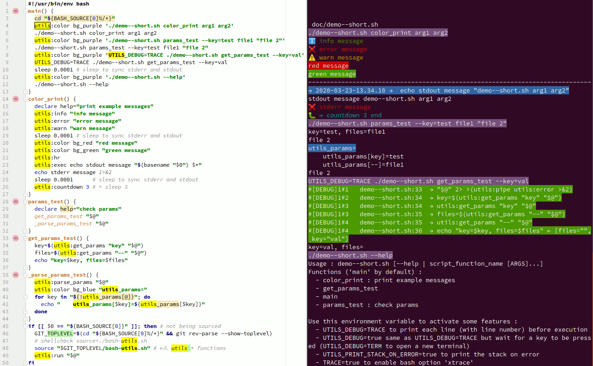

# Bash-utils
Ce projet essaye de faciliter le développement et l'usage de script Bash, notamment en rassemblant
quelques fonctions utilitaires.



## Principes

Pour utiliser ce projet, il faut sourcer le fichier `bash-utils.sh` pour ensuite appeler
la fonction `utils:run` avec tous les arguments du script `"$@"` :

```
#!/usr/bin/env bash
main() {
  echo "main function"
  test_function
}
test_function(){
  test "main function"
}
source "./bash-utils.sh"
utils:run "$@"
```
Il faut alors que tout le code du script se trouve dans des fonctions,
sauf le code d'initailisation bien sûr (les 2 dernières lignes ci-dessus par ex),
et que le code qui doit être appelé par défaut soit dans une fonction `main`.

Si ce script est dans un fichier `my_script.sh` il est alors possible, de lancer la
fonction `main` en lançant le script sans paramètre ou alors de lancer directement
la fonction test avec :
```
./my_script test_function
```

`utils:run` lance donc la fonction passée en premier argument, si on veut passer
des paramètres à cette fonction, `utils:run` passera les paramètres suivants, à partir
du deuxième donc, à la fonction : 
```
./my_script test_function arg1 arg2
```

C'est très pratique pendant le développement pour ne tester qu'une partie du script,
mais également pour proposer une interface en ligne de commande très simplement.

Il est également possible de lancer `my_script.sh --help` pour avoir la listes des
fonctions du script, qui peuvent donc être appelées depuis la ligne de commande.
Dans ce cas, par défaut, les fonctions dont le nom commence par `_` ne sont pas listées
ni accessibles depuis la ligne de commande.

La fonction `utils:run` va appeler `utils:init` qui va alors définir les options de bash qui
sont généralement considérées comme de bonnes pratiques : `errexit`, `nounset`, `pipefail`.

Par défaut, la sortie standard est affichée avec la fonction `utils:error`, c'est à dire, en rouge
en démarrant les lignes d'une croix ❌.

Il est également possible de tracer très simplement les commandes qui sont exécutées
par le script en définissant `UTILS_DEBUG=TRACE`:
```
UTILS_DEBUG=TRACE ./my_script test_function
```
Chaque ligne exécutée sera alors affichée en indiquant le numéro de ligne et les valeurs
des variables utilisées.

Avec `UTILS_DEBUG=true`, il faudra appuyer sur une touche pour passer à l'instruction du script
suivante, c'est un mode "pas à pas". Avec `UTILS_DEBUG=TERM`, c'est également le mode
"pas à pas" mais où le contrôle s'effectue depuis un autre terminal qui est automatiquement ouvert.
Cet ébauche de debugger pourrait être complété d'autres modes plus tard (ajout de
points d'arrets par exemple).

## Les fonctions utilitaires

Les fonctions du script bash-utils.sh sont préfixées par `utils:`  :
  - utils:color : print parameters 2... with $UTILS_PREFIX_COLOR at the beginning with color $1, except if UTILS_NO_COLOR=true, use UTILS_PRINTF_ENDLINE=\n by default
  - utils:countdown
  - utils:debug : print parameters in blue : 🐛  parameters
  - utils:debugger
  - utils:error : print parameters in red to stderr : ❌  parameters
  - utils:exec : print parameter with blue background and execute parameters, print time if UTILS_PRINT_TIME=true
  - utils:flock_exec : run <$2 ...> command with flock (mutex) on '/var/lock/$1.lock' file
  - utils:get_param : same as 'utils:get_params' but return the first result only
  - utils:get_params : print parameter value $1 from "$@", if $1 == '--' print last parameters that doesn't start with by '-' ---- ='e|error' return 'value' for '--error=value' or '-e=value' ---- accept '--error value' and '-e value' if ='e |error '
  - utils:has_param
  - utils:help : print the help of all functions (the declare help='...')
  - utils:hr : print N horizontal line, N=1 by default, N is the first parameter
  - utils:info : print parameters in green : ℹ️  parameters
  - utils:init : init bash options: errexit, nounset, pipefail, xtrace if TRACE==true, trap _utils_print_stack_and_exit_code if UTILS_PRINT_STACK_ON_ERROR==true
  - utils:list_colors
  - utils:list_functions : list all functions of the parent script, set UTILS_HIDE_PRIVATE_FUNCTIONS!= true to list _* functions
  - utils:log : print parameters in green : ℹ️  parameters
  - utils:parse_params : set utils_params array from "$@" : --error=msg -a=123 -zer=5 opt1 'opt 2' -- file --opt3 →→ utils_params = [error]=msg ; [--]=opt1 / opt 2 / file / --opt3 ; [z]=5 ; [r]=5 ; [e]=5 ; [a]=123 (/ is \n here)
  - utils:pipe : for each lines, execute parameters and append line
  - utils:run : run utils:init and run the main function or the function $1, add color and use utils:pipe utils:error for stderr except if UTILS_PIPE_MAIN_STDERR!=true
  - utils:stack : print current stack
  - utils:warn : print parameters in orange to stderr : ️⚠️  parameters

## Les variables d'environnement

Use this environment variable to activate some features :
  - UTILS_DEBUG=TRACE to print each line (with line number) before execution
  - UTILS_DEBUG=true same as UTILS_DEBUG=TRACE but wait for a key to be pressed (UTILS_DEBUG=TERM to open a new terminal)
  - UTILS_PRINT_STACK_ON_ERROR=true to print the stack on error
  - TRACE=true to enable bash option 'xtrace' 

## Supprimer les usages de bash-utils.sh
Il y un script qui permet de supprimer les usages des fonctions de `bash-utils.sh`
si jamais l'on veut supprimer cette dépendance à ce projet : `remove_bash-utils.sh`

On peut ajouter les chemins vers les fichiers à traiter en paramètres :
```
./remove_bash-utils.sh my_script1.sh my_script2.sh
```
ou on peut tester une conversion :
```
< example.sh ./remove_bash-utils.sh > example_without_bash-utils.sh
```
Pour vérifier s'il reste des usages de fonctions utils:* :
```
grep -E "utils:[a-zA-Z0-9_]*" my_script.sh
```


# Bonnes pratiques d'écriture de scripts bash

**⚠ Disclaimer : les pratiques indiquées ici sont considérées bonnes de mon point de vue,
rien que dans les liens ci-dessous, les avis divergent quelques fois des miens et
ne sont pas unanimes sur tous les sujets.**

Ci-dessous, quelques bonnes pratiques acquises avec l'expérience mais surtout avec pas
mal de lectures du web, entre autre :
* https://kvz.io/bash-best-practices.html
* https://bertvv.github.io/cheat-sheets/Bash.html
* https://github.com/progrium/bashstyle
* http://google.github.io/styleguide/shellguide.html
* https://google.github.io/styleguide/shellguide.html
* https://wiki.bash-hackers.org/scripting/obsolete
* https://jvns.ca/blog/2017/03/26/bash-quirks/
* https://sap1ens.com/blog/2017/07/01/bash-scripting-best-practices/
* https://blog.yossarian.net/2020/01/23/Anybody-can-write-good-bash-with-a-little-effort
* http://mywiki.wooledge.org/BashFAQ/031


## Arrêter l'exécution dès la première erreur
Ajouter au début du script : `set -o errexit`, toutes les commandes qui auront un code de sortie différent de 0 stopperont le déroulement du script.

Cette règle est très importante. Par exemple :
```
cd my_folder
rm -rf *
```
Sans l'option `errexit`, ce script effacera tous les fichiers du dossier courant si `my_folder` n'existe pas, alors qu'il s'arrêterait
en erreur sur le `cd` s'il y avait eu un `set -o errexit` avant.

Autre exemple :
```
#!/usr/bin/env bash

test_func() {
  echo "→ test_func begin"
  UNKNOWN_COMMAND_TO_PRODUCE_ERROR
  echo "← test_func end"
}

echo '---------------------- begin ---------------------'
test_func
set -o errexit
echo '------------------- errexit on -------------------'
test_func
echo '----------------------- end ----------------------'
```
Va produire cette sortie :
```
---------------------- begin ---------------------
→ test_func begin
./test.sh: ligne 6: UNKNOWN_COMMAND_TO_PRODUCE_ERROR : commande introuvable
← test_func end
------------------- errexit on -------------------
→ test_func begin
./test.sh: ligne 6: UNKNOWN_COMMAND_TO_PRODUCE_ERROR : commande introuvable
```

Si l'on veut autoriser une commande à sortir en erreur, il faut ajouter `|| true` après cette dernière : `my_func || true` :
```
#!/usr/bin/env bash

set -o errexit

test_func() {
  echo "→ test_func begin"
  UNKNOWN_COMMAND_TO_PRODUCE_ERROR || true
  echo "← test_func end"
}

echo '------------------- 1 -------------------'
test_func
echo '------------------- 2 -------------------'
```
Va produire cette sortie :
```
------------------- 1 -------------------
→ test_func begin
./t.sh: ligne 7: UNKNOWN_COMMAND_TO_PRODUCE_ERROR : commande introuvable
← test_func end
------------------- 2 -------------------
```

`set -o errexit` est l'équivalent plus long de `set -e`. Privilégiez la version longue qui est plus explicite.

### MAIS ATTENTION, cette options n'est pas active dans certains cas

Ce problème fait que l'option `errexit` n'est pas toujours considérée comme une bonne pratique ! à raison car le comportement
n'est pas du tout celui attendu !

Quelques liens sur ce sujet :
- http://mywiki.wooledge.org/BashFAQ/105 ← voir la partie `Exercises` en bas !
- https://stackoverflow.com/questions/29926013/exit-subshell-on-error ← ` I think it is good reason to hate both set -e and shell scripting in general.`
- https://david.rothlis.net/shell-set-e/ ← `Bash experts seem to agree: “never rely on set -e” (gnu.bash.bug, BashFAQ). The recommendation is to do your own error checking by stringing together a series of commands with “&&”`
- https://fvue.nl/wiki/Bash:_Error_handling ← `Opinions differ about whether it's wise to use set -e, because of its seemingly non-intuitive problems...`
- https://www.in-ulm.de/~mascheck/various/set-e/

cf le man de bash :
```
The shell does not exit if the command that fails  is  part  of  the command list immediately following
a while or until keyword, part of the test following the if or elif reserved words, part of any command
executed in a && or || list except the command following the final && or ||, any command in a pipeline
but the last, or if the command's return value is being inverted with !.
If a compound command other than a subshell returns a non-zero status because  a command  failed
while -e was being ignored, the shell does not exit.
A trap on ERR, if set, is executed before the shell exits.  This option applies to the shell environment
and each subshell environment separately (see COMMAND EXECUTION ENVIRONMENT above),
and may cause subshells to exit before executing all the commands in the subshell.
If a compound command or shell function executes in a context where -e is being ignored, none of the
commands executed within the compound command or function body will be affected by the -e setting,
even if -e is set and a command returns a failure status.  If a compound command or shell function
sets -e while executing in a context where -e is ignored, that setting will not have any effect until the
compound command or the command containing the function call completes.
```

Donc, attention, `errexit` ne marchera pas pour le code d'une fonction dont l'appel est suivi
de `||` ou `&&` ou inclus dans un if ! Par exemple :
```
#!/usr/bin/env bash

set -o errexit

test_func() {
  echo "→ test_func begin" >&2 # stderr
  UNKNOWN_COMMAND_TO_PRODUCE_ERROR
  echo "← test_func end" >&2 # stderr
}

echo 'test_func || echo "err_||"'
test_func || echo "err_||"

echo '------------------- 1 -------------------'
echo 'if test_func ; then echo "err_if"; fi :'
if test_func ; then echo "err_if"; fi

echo '------------------- 2 -------------------'
echo 'out=$(test_func)  # [inherit_errexit off]'
out=$(test_func)
echo "1 - exitcode=$?"

echo '------------------- 3 -------------------'
shopt -s inherit_errexit
echo 'out=$(test_func)  # [inherit_errexit on]'
out=$(test_func)
echo "2 - exitcode=$?"
```
Va produire cette sortie :
```
test_func || echo "err_||"
→ test_func begin
./test.sh: ligne 7: UNKNOWN_COMMAND_TO_PRODUCE_ERROR : commande introuvable
← test_func end
------------------- 1 -------------------
if test_func ; then echo "err_if"; fi :
→ test_func begin
./test.sh: ligne 7: UNKNOWN_COMMAND_TO_PRODUCE_ERROR : commande introuvable
← test_func end
err_if
------------------- 2 -------------------
out=$(test_func)  # [inherit_errexit off]
→ test_func begin
./test.sh: ligne 7: UNKNOWN_COMMAND_TO_PRODUCE_ERROR : commande introuvable
← test_func end
1 - exitcode=0
------------------- 3 -------------------
out=$(test_func)  # [inherit_errexit on]
→ test_func begin
./test.sh: ligne 7: UNKNOWN_COMMAND_TO_PRODUCE_ERROR : commande introuvable
```
On voit bien que malgré le `set -o errexit`, le `echo "← test_func end"` est atteint dans les
2 premiers appels de `test_func`, malgré le `UNKNOWN_COMMAND_TO_PRODUCE_ERROR` (qui a un code de sortie de 127) !

### inherit_errexit
On peut aussi voir, dans ce dernier exemple,que le `shopt -s inherit_errexit` fait arrêter le script sur le `out=$(test_func)`
alors que sans cette option, le script continu.

### pour récupérer le code de sortie malgré le errexit

Si l'option `errexit` est activée, on ne peut pas obtenir le code de sortie de la précédente commande avec `$?`, car
si ce code de sortie est différent de 0, le script s'arrete en erreur...

une astuce consiste alors à utiliser `!` devant la commande, qui autorise la commande à échouer,
mais où on peut alors récupérer le code de sortie dans `${PIPESTATUS[0]}`:
```
#!/usr/bin/env bash

set -o errexit

  (exit 0)
echo "  (exit 0)  → \$?=$? -- \${PIPESTATUS[0]}=${PIPESTATUS[0]}"

! (exit 0)
echo "! (exit 0)  → \$?=$? -- \${PIPESTATUS[0]}=${PIPESTATUS[0]}"

! (exit 15)
echo "! (exit 15) → \$?=$? -- \${PIPESTATUS[0]}=${PIPESTATUS[0]}"
```
Va produire cette sortie :
```
  (exit 0)  → $?=0 -- ${PIPESTATUS[0]}=0
! (exit 0)  → $?=1 -- ${PIPESTATUS[0]}=0
! (exit 15) → $?=0 -- ${PIPESTATUS[0]}=15
```
`${PIPESTATUS[0]}` contient bien le code de sortie souhaité. Le fonctionnement de `PIPESTATUS` est décrit plus bas.

Attention, les remarque du paragraphe `cette options n'est pas active dans certains cas`
s'appliquent aussi à `! commande`


Un contournement possible pour exécuter une fonction et savoir si elle a échouée
tout en gardant l'option le principe de `errexit` actif (TODO à compléter) :
```
#!/usr/bin/env bash
set -o errexit
shopt -s inherit_errexit
func_ko() {
  (exit 3)
  echo "← func_ko end ⚠️ ⚠️ ⚠️"
}
func_ok() {
  echo "→ func_ok"
}
fake_exit_code_func() { # "exit code" is 0 if true exit code is 0, else 1
  local ex=$("$@" >&2; echo 0) # FIXME : stdout stderr are merged
  if [[ $ex = 0 ]]; then
    echo 0
  else
    echo 1
  fi
}
echo "--- if func_ko; then echo pb; fi :"
if func_ko; then echo ok-0; else echo ko-0; fi

echo "--- if [[ $(fake_exit_code_func func_ko) = 0 ]] :"
if [[ $(fake_exit_code_func func_ko) = 0 ]]; then echo ok-1; else echo ko-1; fi

echo "--- if [[ \$fake_exit_code = 0 ]] :"
fake_exit_code=$(fake_exit_code_func func_ko)
if [[ $fake_exit_code = 0 ]]; then echo ok-2; else echo ko-2; fi

echo "fake_exit_code_func func_ko = $(fake_exit_code_func func_ko)"
echo "fake_exit_code_func func_ok = $(fake_exit_code_func func_ok)"
```
`← func_ko end` ne sera pas affiché avec `fake_exit_code_func`, mais la sortie standard de `fake_exit_code_func` sera `1`.
La sortie du script :
```
--- if func_ko; then echo pb; fi :
← func_ko end ⚠️ ⚠️ ⚠️
ok-0
--- if [[ 1 = 0 ]] :
← func_ko end ⚠️ ⚠️ ⚠️
ok-1
--- if [[ $fake_exit_code = 0 ]] :
ko-2
fake_exit_code_func func_ko = 1
→ func_ok
fake_exit_code_func func_ok = 0
```

## Détecter les variables non initialisées
Ajouter dans le script : `set -o nounset` pour que le script s'arrete en erreur si une variable non initialisée est utilisée.

C'est l'équivalent plus long de `set -u`. Privilégiez la version longue qui est plus explicite.

Penser à `${my_var:-}` pour initialiser my_var à une valeur vide ou non définie (voir ci-dessous).


## Initialiser les variables qui ont le droit d'être non initialisées

Utiliser `${var:-default value}` pour définir une valeur par défaut si la variable
n'est pas initialisée
```
set -o nounset
directory=${DIRECTORY:-}
file=${FILE:-foo}
```
Sans ça, l'usage de `set -o nounset` arrêtera le script si une variable non initialisée est utilisée.

## Détecter les erreurs lorsque l'on utilise les pipes : `cmd1 | cmd2`
Ajouter dans le script : `set -o pipefail` pour que le code d'erreur soit celui de la première
commande et non celle utilisée dans le pipe.

Pour :
```
exit 1 | exit 0
echo $?
```
Sans l'option `pipefail` et le script continuera même si l'option `errexit` est activée car le code de retour considéré sera celui de `exit 0`,
alors qu'avec l'option `pipefail`, le code de sortie sera 1 et le script s'arretera alors si `errexit` est activé
(le `echo` ne sera pas exécuté dans ce cas là car le script se sera arrêté sur le `exit 1`).

```
#!/usr/bin/env bash

echo 'UNKNOWN_COMMAND_TO_PRODUCE_ERROR | true   # pipefail off -- errexit off'
UNKNOWN_COMMAND_TO_PRODUCE_ERROR | true
echo "exitcode=$? - \$PIPESTATUS=$PIPESTATUS"

set -o pipefail

echo 'UNKNOWN_COMMAND_TO_PRODUCE_ERROR | true   # pipefail on -- errexit off'
UNKNOWN_COMMAND_TO_PRODUCE_ERROR | true
echo "exitcode=$? - \$PIPESTATUS=$PIPESTATUS"

set +o pipefail
set -o errexit

echo 'UNKNOWN_COMMAND_TO_PRODUCE_ERROR | true   # pipefail off -- errexit on'
UNKNOWN_COMMAND_TO_PRODUCE_ERROR | true
echo "exitcode=$? - \$PIPESTATUS=$PIPESTATUS"

set -o pipefail

echo 'UNKNOWN_COMMAND_TO_PRODUCE_ERROR | true   # pipefail on -- errexit on'
UNKNOWN_COMMAND_TO_PRODUCE_ERROR | true
echo "exitcode=$? - \$PIPESTATUS=$PIPESTATUS"
```
Va produire cette sortie :
```
UNKNOWN_COMMAND_TO_PRODUCE_ERROR | true   # pipefail off -- errexit off
./test.sh: ligne 4: UNKNOWN_COMMAND_TO_PRODUCE_ERROR : commande introuvable
exitcode=0 - $PIPESTATUS=127
UNKNOWN_COMMAND_TO_PRODUCE_ERROR | true   # pipefail on -- errexit off
./test.sh: ligne 10: UNKNOWN_COMMAND_TO_PRODUCE_ERROR : commande introuvable
exitcode=127 - $PIPESTATUS=127
UNKNOWN_COMMAND_TO_PRODUCE_ERROR | true   # pipefail off -- errexit on
./test.sh: ligne 17: UNKNOWN_COMMAND_TO_PRODUCE_ERROR : commande introuvable
exitcode=0 - $PIPESTATUS=127
UNKNOWN_COMMAND_TO_PRODUCE_ERROR | true   # pipefail on -- errexit on
./test.sh: ligne 23: UNKNOWN_COMMAND_TO_PRODUCE_ERROR : commande introuvable
```

### PIPESTATUS
à noter que la variable `$PIPESTATUS` contient le code de retour de la commande à droite du pipe.
C'est même un tableau :
```
#!/usr/bin/env bash
exit 0 | exit 1 | exit 2 | exit 3
echo "exit 0 | exit 1 | exit 2 | exit 3 : exitcode=$? - \$PIPESTATUS=${PIPESTATUS[@]}"
exit 0 | exit 1
echo "exit 0 | exit 1 : exitcode=$? - \$PIPESTATUS=${PIPESTATUS[@]}"
exit 1 | exit 0
echo "exit 1 | exit 0 : exitcode=$? - \$PIPESTATUS=${PIPESTATUS[@]}"

echo '→ set -o pipefail'
set -o pipefail

exit 0 | exit 1 | exit 2 | exit 3
echo "exit 0 | exit 1 | exit 2 | exit 3 : exitcode=$? - \$PIPESTATUS=${PIPESTATUS[@]}"
exit 0 | exit 1
echo "exit 0 | exit 1 : exitcode=$? - \$PIPESTATUS=${PIPESTATUS[@]}"
exit 1 | exit 0
echo "exit 1 | exit 0 : exitcode=$? - \$PIPESTATUS=${PIPESTATUS[@]}"
```
Va produire cette sortie :
```
exit 0 | exit 1 | exit 2 | exit 3 : exitcode=3 - $PIPESTATUS=0 1 2 3
exit 0 | exit 1 : exitcode=1 - $PIPESTATUS=0 1
exit 1 | exit 0 : exitcode=0 - $PIPESTATUS=1 0
→ set -o pipefail
exit 0 | exit 1 | exit 2 | exit 3 : exitcode=3 - $PIPESTATUS=0 1 2 3
exit 0 | exit 1 : exitcode=1 - $PIPESTATUS=0 1
exit 1 | exit 0 : exitcode=1 - $PIPESTATUS=1 0
```


## Mettre tout le code dans des fonctions

Permet de clarifier le code, exécuter une fonction en particulier, ...

## Utiliser une fonction main pour le code principal

## Utiliser `my_func() { ... }` plutôt que `function my_func { ... }`

## Utiliser des variables plutôt que des paramètres

Plus discutable ! Mais très pratique, cela évite pas mal de code de gestion
des paramètres et avec l'option `set -o nounset`, on détecte facilement les
problèmes d'initialisation des variables.

Pour exécuter un script avec des variables, dans ce cas :
```
var1=value1 ./my_script.sh
```

```
my_func() {
  echo "${var1}${var2}"
}
foo(){
var1="b"
var2="ar"
my_func
}
```
et il est possible de lancer un script avec `var1=b var2=ar ./my_script.sh`.

L'équivalent avec des paramètres nommés est beaucoup plus longue :
```
my_func() {
  while [[ $# -gt 0 ]]
  do
    key="$1"
    case $key in
        --var1)
        var1="$2"
        shift
        shift
        ;;
        --var2)
        var2="$2"
        shift
        shift
        ;;
        *)
        shift
        ;;
    esac
  done
  echo "${var1}${var2}"
}
foo(){
  my_func --var2 "ar" --var1 "b"
}
```
Si on se base sur l'ordre des paramètres :
```
my_func() {
  var1="$1"
  var2="$2"
  echo "${var1}${var2}"
}
foo(){
  my_func "ar" "b"
}
```
Ça redevient plus cours mais il faut gérer l'ordre des paramètres et c'est moins clair coté
appelant (le param numéro X correspond à quoi, ...).

## Détecter si le script est sourcé ou exécuté

N'exécuter main seulement si le script est exécuté et pas sourcé :
```
if [[ $0 == "${BASH_SOURCE[0]}" ]]; then
  main "${@}"
fi
```

"sourcé" signifie `source ./my_script.sh` ou `. ./my_script.sh`, qui revient à importer le code en
quelque sorte, il est exécuté en réalité, et ses fonctions sont alors dorénavant accessibles.

## Utiliser snake_case pour les noms des variables et des fonctions

## `#!/usr/bin/env bash` plutôt que `#!/bin/bash`

## Utilise Shellcheck pour détecter les erreurs

## Utilise shfmt pour formater le code

## Utiliser un IDE pour écrire des scripts
Les IDE récents, notamment Intellij, permettent d'écrire du code bash en détectant
des erreurs potentielles et en formatant le code, comme n'importe quel langage.

shfmt et shellsheck sont inclus dans Intellij par exemple.

## Utiliser `trap` pour déclencher du code à la fin du script ou sur une erreur
```
trap cleanup EXIT ERR
```
cette ligne déclenchera l'exécution de la fonction `cleanup` lorsque le script se terminera.

Dans ce cas, pensez à bien propager le code de sortie (si c'est souhaité) :
```
cleanup() {
    exitcode=$?
    ...
    exit $exitcode
}
```

## Utiliser des namespaces

Bash ne propose pas de namespaces à proprement parler, mais on peut nommer les fonctions
avec un préfixe commun pour identifier les fonctions d'un script ou d'une partie donnée.

Le séparateur peut être `_` ou `:` par exemple :
```
mysh:print(){ ... }
mysh:foo(){ ... }
mysh:bar(){ ... }
```

## Faire des tests unitaires avec bats
https://github.com/bats-core/bats-core
```
@test "addition using bc" {
  result="$(echo 2+2 | bc)"
  [ "$result" -eq 4 ]
}
```

## utiliser version longue des paramètres
`curl --show-error ...` plutôt que `curl -S ...`

## Utiliser ${var} plutôt que $var

à nuancer

## Naviguer dans les dossiers depuis un subshell

```
(
 cd dir/
 do_something
)
```
plutôt que
```
cd dir/
do_something
cd ..
```

## Fonctions privées
Pour les fonctions qui ne sont pas destinées à être utilisées dans d'autres scripts,
On peut préfixer le nom de la fonction par `_` et ne pas utiliser de préfixe de namespace :
```
_my_private_function() {
}
my_script:my_func() {
  _my_private_function
}
```

# Astuces

## Activer l'affichage des commandes exécutées si TRACE=1
Placer `[[ ${TRACE:-0} != 1 ]] || set -o xtrace` dans le script pour activer l'affichage
des lignes de code exécutées facilement.

Pour lancer le script en mode debug : `TRACE=1 ./my_script.sh`

`set -o xtrace` est la version longue de `set -x`

## Permettre l'exécution d'une fonction en particulier

Par exemple, si on passe des paramètres au script :
```
if [[ $# == 0 ]]; then # if the script has no argument, run the main() function
  main
else
  "$@"
fi
```
Si on exécute ce script avec `./my_script.sh test_function arg1 arg2`,
ça ne lancera que la fonction `test_function` avec les 2 paramètres.

C'est très pratique pour le dev, debug et les TUs entre autre, ou pour proposer des
fonctionnalités facilement depuis la ligne de commande.

## Pour documenter l'aide d'une fonction

```
my_func ()
{
    declare help="help message here";
    ...
}
eval "$(type my_func | grep 'declare help=')"
echo $help
```

## Pour les projets versionnés avec git
Vous pouvez
```
  GIT_TOPLEVEL=$(cd "${BASH_SOURCE[0]%/*}" && git rev-parse --show-toplevel)
```
Ensuite il est possible de se déplacer dans les dossiers du projet ou référencer des fichiers de façon
absolu, c'est pratique car en cas de déplacement d script, les chemins restent valides.


## Utiliser flock pour exécuter une partie du code une seule fois en même temps

```
lock_file=/var/lock/my_script.lock
(
    echo "wait $lock_file"
    flock -x 200
    echo "→ got $lock_file"
    do stuff
    ...
) 200>"$lock_file"
```


# TODO list

* écrire la version anglaise du README
* permettre l'ajout de l'horodatage aux lignes de stderr et ou stdout
* ajout de "local" dans les bonnes pratiques
* mettre à jour le script  remove_bash-utils.sh
* traiter les TODO du code

